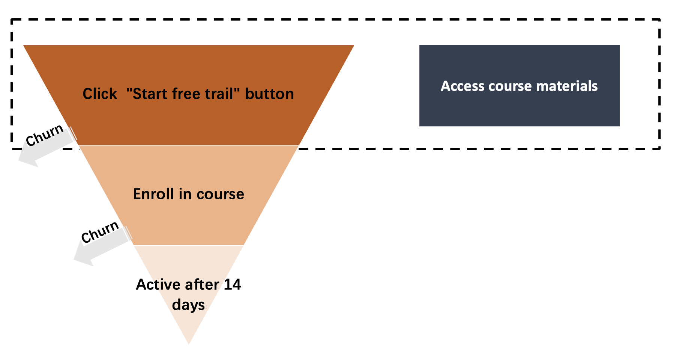

# Introduction
This file contains the experiment design process.

# Operation Funnel
- Control group 

- Treatment Group

According to the pictures above, we are expected to see the number of retention users after 14 days keep the same and the number of users who access the course material increase. The main goal is to increase the user experiences and Udacity want the number of frastrated users who enrolled in the course decrease.

# Metrics Selection
The Introduction offers 7 metrics:

---
- Number of cookies: That is, number of unique cookies to view the course overview page. (dmin=3000)
- Number of user-ids: That is, number of users who enroll in the free trial. (dmin=50)
- Number of clicks: That is, number of unique cookies to click the "Start free trial" button (which happens before the free trial screener is trigger). (dmin=240)
- Click-through-probability: That is, number of unique cookies to click the "Start free trial" button divided by number of unique cookies to view the course overview page. (dmin=0.01)
- Gross conversion: That is, number of user-ids to complete checkout and enroll in the free trial divided by number of unique cookies to click the "Start free trial" button. (dmin= 0.01)
- Retention: That is, number of user-ids to remain enrolled past the 14-day boundary (and thus make at least one payment) divided by number of user-ids to complete checkout. (dmin=0.01)
- Net conversion: That is, number of user-ids to remain enrolled past the 14-day boundary (and thus make at least one payment) divided by the number of unique cookies to click the "Start free trial" button. (dmin= 0.0075)
---

We need to select two types of metrics, one is <b>invariant metric</b> for sanity check which is expected not to be affected by experiment and another one is evaluation metric.
Since our changes are made after users click on the 'Start free trail' button. Therefore, the metrics that are related to the user journey before reaching to this button, should remain invariant. I finally select three of them.

| No.| Invariant Metrics       |
|---|---------------------------|
| 1 | Number of cookies         |
| 2 | Number of clicks          |
| 3 | Click-through-probability |

As for the evaluation metric, I show them in the following table due to they are all related to the function we changed.

| No.| Evaluation Metrics       |
|---|---------------------------|
| 1 | Gross conversion         |
| 2 | Retention          |
| 3 | Net conversion |

I decide not to use Number of user-ids who enroll in the free trail because this could not tell us wheather a user get frastrated on the course and thus could help us decide the effect of the change. It can't be used as an invariant metric either because the number of users will definitely decrease because of the new function.

# Sizing/Duration/Exposure
 Next step is to decide the number of samples given alpha (0.05) and beta(0.2). We now have the baseline value for the metrics above.
 
Metric                    | Explanation                                          | Value     |
|---------------------------|------------------------------------------------------|-----------|
| Number of cookies         | Unique cookies to view course overview page per day: |     40000 |
| Number of clicks          | Unique cookies to click "Start free trial" per day:  |      3200 |
| Number of user-ids        | Enrollments per day:                                 |       660 |
| Click-through-probability | Click-through-probability on "Start free trial":     |      0.08 |
|  Gross conversion         | Probability of enrolling, given click:               |   0.20625 |
| Retention                 | Probability of payment, given enroll:                |      0.53 |
| Net conversion            | Probability of payment, given click                  | 0.1093125 |

We could use a [online sample size calculator](https://www.evanmiller.org/ab-testing/sample-size.html) to see the expected sample size for each group.

| Metrics          | Pratical Difference | Sample Size Per Group | Required Cookies who view the course overview page, per group | Required Cookies  for both groups | Required Days             |
|------------------|---------------------|-----------------------|----------------------------------------------------------------|-----------------------------------|---------------------------|
| Gross conversion |                0.01 |                25,835 |                                     25835 * 40K/3.2K =322937.5 |                          645875.0 | Required cookies/40K=16.1 |
| Retention        |                0.01 |                39,115 |                                     39115 * 40K/660 =2370606.1 |                         4741212.1 |                     118.5 |
| Net conversion   |              0.0075 |                27,413 |                                     27413 * 40K/3.2K =342662.5 |                          685325.0 |                      17.1 |

After deciding the sample size, we could calculate the estimated page views required for this experiment (See the column Required Cookies for both groups, which is per group * 2 because we expect equal data in both control and treatment group). 

Since the maximum traffic for the course page is only 40K, if we use 100% traffic, the experiment duration could be calculated (See the column Required days) However, we could notice that the required days for retention is 118 days which is too long for us. Therefore, we will only keep Gross conversion and Net conversion as our evaluation metrics.

Next, we need to decide the traffic we use. If we use 100% traffic, the required time are 2-3 weeks; if we use 50% traffic, we need to extend the experiment time to 5-6 weeks.
